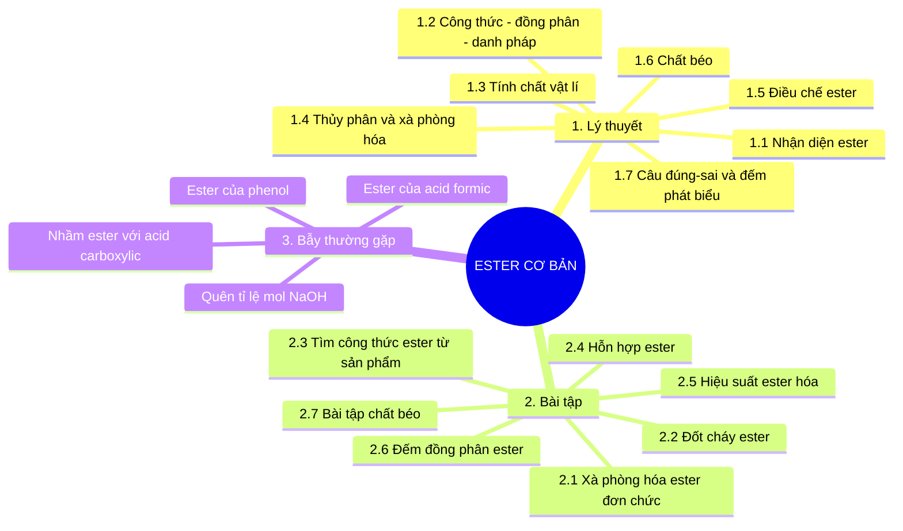

# Phân dạng & phương pháp xử lý câu lý thuyết và bài tập Ester cơ bản

> Mục tiêu: biến chuyên đề **Ester** thành một bộ “bản đồ xử lý đề” để học sinh nhìn đề là biết thuộc dạng nào, dùng phản ứng nào, đặt ẩn nào và tránh bẫy nào.

---

## 0. Sơ đồ tư duy tổng quát



---

## 1. Kiến thức lõi cần nhớ

### 1.1. Khái niệm ester

Ester là sản phẩm thu được khi thay nhóm `-OH` trong nhóm carboxyl `-COOH` của acid carboxylic bằng nhóm `-OR'`.

Công thức dạng chung:

$$
\mathrm{RCOOR'}
$$

Trong đó:

- $\mathrm{RCO-}$ là phần gốc acid.
- $\mathrm{-OR'}$ là phần gốc alcohol hoặc phenol.
- Nhóm chức đặc trưng của ester là:

$$
\mathrm{-COO-}
$$

Lưu ý: Không phải cứ có `COO` là ester. Cần nhìn đúng liên kết:

| Chất | Có phải ester không? | Vì sao? |
|---|---:|---|
| $\mathrm{CH_3COOCH_3}$ | Có | Dạng $\mathrm{RCOOR'}$ |
| $\mathrm{CH_3COOH}$ | Không | Acid carboxylic |
| $\mathrm{CH_3COONa}$ | Không | Muối carboxylate |
| $\mathrm{HCOOC_2H_5}$ | Có | Ester của acid formic |
| $\mathrm{C_6H_5OOCCH_3}$ | Có thể có | Cần viết lại đúng cấu tạo để xác định |

---

### 1.2. Công thức phân tử ester no, đơn chức, mạch hở

Với ester **no, đơn chức, mạch hở**:

$$
\mathrm{C_nH_{2n}O_2} \quad (n \ge 2)
$$

Ví dụ:

| Công thức phân tử | Một ester tương ứng |
|---|---|
| $\mathrm{C_2H_4O_2}$ | $\mathrm{HCOOCH_3}$ |
| $\mathrm{C_3H_6O_2}$ | $\mathrm{HCOOC_2H_5}$ hoặc $\mathrm{CH_3COOCH_3}$ |
| $\mathrm{C_4H_8O_2}$ | $\mathrm{CH_3COOC_2H_5}$, $\mathrm{HCOOC_3H_7}$, ... |

---

### 1.3. Phản ứng lõi của ester

#### 1.3.1. Thủy phân trong môi trường acid

$$
\mathrm{RCOOR' + H_2O \rightleftharpoons RCOOH + R'OH}
$$

Đặc điểm:

- Phản ứng thuận nghịch.
- Xúc tác thường là $\mathrm{H^+}$.
- Không dùng để tính theo kiểu phản ứng hoàn toàn nếu đề không cho dữ kiện cân bằng hoặc hiệu suất.

#### 1.3.2. Thủy phân trong môi trường kiềm, còn gọi là xà phòng hóa

$$
\mathrm{RCOOR' + NaOH \rightarrow RCOONa + R'OH}
$$

Đặc điểm:

- Phản ứng coi như một chiều.
- Với ester đơn chức: tỉ lệ mol thường là:

$$
n_{\mathrm{ester}} = n_{\mathrm{NaOH}}
$$

- Đây là phản ứng quan trọng nhất trong bài tập ester cơ bản.

---

## 2. Phân dạng câu lý thuyết Ester

---

## 2.1. Dạng 1: Nhận diện chất nào là ester

### Dấu hiệu đề bài

Đề thường hỏi:

- Chất nào sau đây là ester?
- Chất nào có nhóm chức ester?
- Công thức nào là ester?
- Trong các chất sau, số chất thuộc loại ester là bao nhiêu?

### Phương pháp xử lý

Làm theo 3 bước:

1. Tìm nhóm `C=O`.
2. Kiểm tra sau carbonyl có nối với oxygen không: `-C(=O)-O-`.
3. Sau oxygen phải là gốc hydrocarbon, không phải H hoặc kim loại.

Dạng đúng:

$$
\mathrm{R-C(=O)-O-R'}
$$

### Bẫy thường gặp

| Trường hợp | Nhận xét |
|---|---|
| $\mathrm{RCOOH}$ | Acid, không phải ester |
| $\mathrm{RCOONa}$ | Muối, không phải ester |
| $\mathrm{ROH}$ | Alcohol, không phải ester |
| $\mathrm{RCOOR'}$ | Ester |
| $\mathrm{HCOOR'}$ | Vẫn là ester, cụ thể là ester của acid formic |

### Cách nói cho học sinh dễ nhớ

> Ester là “acid carboxylic bị thay H trong nhóm `-COOH` bằng gốc hydrocarbon”.

---

## 2.2. Dạng 2: Công thức chung và đồng phân ester

### Dấu hiệu đề bài

Đề thường hỏi:

- Công thức chung của ester no, đơn chức, mạch hở là gì?
- Có bao nhiêu ester ứng với công thức $\mathrm{C_nH_{2n}O_2}$?
- Viết các đồng phân ester của $\mathrm{C_3H_6O_2}$, $\mathrm{C_4H_8O_2}$, ...

### Phương pháp xử lý

Với ester no, đơn chức, mạch hở:

$$
\mathrm{C_nH_{2n}O_2}
$$

Khi đếm đồng phân ester, dùng khung:

$$
\mathrm{RCOOR'}
$$

Tổng số carbon được chia thành 2 phần:

- Phần acid: $\mathrm{RCOO-}$, bắt buộc có ít nhất 1 carbon là carbonyl.
- Phần alcohol: $\mathrm{-R'}$, bắt buộc có ít nhất 1 carbon.

### Ví dụ đếm nhanh

#### Với $\mathrm{C_3H_6O_2}$

Chia 3 carbon:

1. Acid có 1C, alcohol có 2C:

$$
\mathrm{HCOOC_2H_5}
$$

2. Acid có 2C, alcohol có 1C:

$$
\mathrm{CH_3COOCH_3}
$$

Vậy có 2 ester.

#### Với $\mathrm{C_4H_8O_2}$

Các ester thường gặp:

1. $\mathrm{HCOOCH_2CH_2CH_3}$
2. $\mathrm{HCOOCH(CH_3)_2}$
3. $\mathrm{CH_3COOC_2H_5}$
4. $\mathrm{C_2H_5COOCH_3}$

Vậy có 4 ester.

#### Bảng nhớ nhanh

| Công thức | Số đồng phân ester no, đơn chức, mạch hở |
|---|---:|
| $\mathrm{C_2H_4O_2}$ | 1 |
| $\mathrm{C_3H_6O_2}$ | 2 |
| $\mathrm{C_4H_8O_2}$ | 4 |
| $\mathrm{C_5H_{10}O_2}$ | 9 |

---

## 2.3. Dạng 3: Danh pháp ester

### Dấu hiệu đề bài

Đề thường hỏi:

- Tên gọi của ester là gì?
- Công thức cấu tạo ứng với tên gọi nào?
- Methyl acetate/ethyl formate là chất nào?

### Phương pháp xử lý

Tên ester thường có dạng:

```text
Tên gốc R' + tên gốc acid đổi đuôi thành -ate
```

Theo cách gọi phổ thông ở THPT:

| Công thức | Tên thường gặp |
|---|---|
| $\mathrm{HCOOCH_3}$ | Methyl formate |
| $\mathrm{HCOOC_2H_5}$ | Ethyl formate |
| $\mathrm{CH_3COOCH_3}$ | Methyl acetate |
| $\mathrm{CH_3COOC_2H_5}$ | Ethyl acetate |
| $\mathrm{C_2H_5COOCH_3}$ | Methyl propionate |

### Mẹo xử lý

Trong $\mathrm{RCOOR'}$:

- Nhìn **bên phải oxygen** để gọi gốc alcohol trước.
- Nhìn **bên trái nhóm COO** để gọi gốc acid sau.

Ví dụ:

$$
\mathrm{CH_3COOC_2H_5}
$$

- Bên phải oxygen: $\mathrm{C_2H_5}$ là ethyl.
- Bên trái: $\mathrm{CH_3COO-}$ là acetate.

Tên: **ethyl acetate**.

---

## 2.4. Dạng 4: Tính chất vật lí của ester

### Dấu hiệu đề bài

Đề thường hỏi phát biểu đúng/sai về:

- Nhiệt độ sôi.
- Độ tan trong nước.
- Mùi của ester.
- Liên kết hydrogen.

### Phương pháp xử lý

Ghi nhớ 4 ý chính:

1. Ester thường có mùi thơm dễ chịu, nhiều ester có mùi hoa quả.
2. Ester nhẹ thường là chất lỏng, dễ bay hơi.
3. Ester không tạo liên kết hydrogen giữa các phân tử ester với nhau vì không có nhóm `-OH`.
4. Ester có nhiệt độ sôi thấp hơn acid carboxylic và alcohol có phân tử khối tương đương.

### Bẫy thường gặp

| Phát biểu | Đúng/Sai | Giải thích |
|---|---:|---|
| Ester có mùi thơm, nhiều ester có mùi trái cây | Đúng | Kiến thức thực nghiệm |
| Ester tan vô hạn trong nước | Sai | Đa số ít tan, ester nhỏ tan một phần |
| Ester có nhiệt độ sôi cao hơn acid cùng số carbon | Sai | Acid tạo liên kết hydrogen mạnh |
| Ester không có khả năng nhận liên kết hydrogen với nước | Sai | Ester có O nên có thể nhận H-bond từ nước, nhưng không tự cho H-bond |

---

## 2.5. Dạng 5: Tính chất hóa học — thủy phân và xà phòng hóa

### Dấu hiệu đề bài

Đề thường hỏi:

- Sản phẩm khi thủy phân ester là gì?
- Ester phản ứng với NaOH tạo chất nào?
- So sánh thủy phân trong acid và trong kiềm.
- Số mol NaOH cần dùng.

### Phương pháp xử lý

#### Trường hợp 1: Thủy phân acid

$$
\mathrm{RCOOR' + H_2O \rightleftharpoons RCOOH + R'OH}
$$

Sản phẩm:

- Acid carboxylic.
- Alcohol.

#### Trường hợp 2: Xà phòng hóa bằng NaOH

$$
\mathrm{RCOOR' + NaOH \rightarrow RCOONa + R'OH}
$$

Sản phẩm:

- Muối sodium carboxylate.
- Alcohol.

### Ví dụ

Với ethyl acetate:

$$
\mathrm{CH_3COOC_2H_5 + NaOH \rightarrow CH_3COONa + C_2H_5OH}
$$

### Bẫy quan trọng: ester của phenol

Với ester dạng:

$$
\mathrm{RCOOC_6H_5}
$$

Khi phản ứng với NaOH, sản phẩm ban đầu có phenol. Nhưng phenol tiếp tục phản ứng với NaOH tạo muối phenoxide.

Phương trình tổng quát:

$$
\mathrm{RCOOC_6H_5 + 2NaOH \rightarrow RCOONa + C_6H_5ONa + H_2O}
$$

Vì vậy:

- Ester thường: 1 mol ester đơn chức dùng 1 mol NaOH.
- Ester của phenol: 1 mol ester có thể dùng 2 mol NaOH.

---

## 2.6. Dạng 6: Điều chế ester

### Dấu hiệu đề bài

Đề thường hỏi:

- Điều chế ester từ chất nào?
- Phản ứng ester hóa là gì?
- Vai trò của $\mathrm{H_2SO_4}$ đặc.
- Vì sao phản ứng ester hóa có hiệu suất không đạt 100%?

### Phương pháp xử lý

Phản ứng ester hóa cơ bản:

$$
\mathrm{RCOOH + R'OH \rightleftharpoons RCOOR' + H_2O}
$$

Điều kiện thường gặp:

- $\mathrm{H_2SO_4}$ đặc.
- Đun nóng.

Vai trò của $\mathrm{H_2SO_4}$ đặc:

1. Xúc tác acid.
2. Hút nước, làm cân bằng chuyển dịch theo chiều tạo ester.

### Bẫy thường gặp

| Phát biểu | Đúng/Sai | Giải thích |
|---|---:|---|
| Ester hóa là phản ứng một chiều | Sai | Là phản ứng thuận nghịch |
| $\mathrm{H_2SO_4}$ đặc chỉ có vai trò hút nước | Sai | Vừa xúc tác vừa hút nước |
| Tăng lượng alcohol hoặc acid có thể tăng hiệu suất ester | Đúng | Do chuyển dịch cân bằng |
| Muốn điều chế ethyl acetate có thể dùng acetic acid và ethanol | Đúng | Phản ứng ester hóa |

---

## 2.7. Dạng 7: Chất béo

### Dấu hiệu đề bài

Đề thường hỏi:

- Chất béo là gì?
- Xà phòng hóa chất béo tạo gì?
- Vì sao dầu lỏng có thể chuyển thành mỡ rắn?
- Tính số mol NaOH/KOH phản ứng với triglyceride.

### Kiến thức lõi

Chất béo là triester của glycerol với acid béo.

Dạng tổng quát:

$$
\mathrm{C_3H_5(OOCR)_3}
$$

Phản ứng xà phòng hóa:

$$
\mathrm{C_3H_5(OOCR)_3 + 3NaOH \rightarrow C_3H_5(OH)_3 + 3RCOONa}
$$

Tỉ lệ mol cần nhớ:

$$
n_{\mathrm{NaOH}} = 3n_{\mathrm{chất\ béo}}
$$

$$
n_{\mathrm{glycerol}} = n_{\mathrm{chất\ béo}}
$$

### Bẫy thường gặp

| Bẫy | Cách tránh |
|---|---|
| Quên chất béo là triester | Nhớ 1 phân tử chất béo có 3 nhóm ester |
| Lấy tỉ lệ NaOH : chất béo = 1 : 1 | Sai, phải là 3 : 1 |
| Nhầm xà phòng là ester | Xà phòng là muối sodium/potassium của acid béo |
| Nhầm dầu lỏng và mỡ rắn | Dầu thường nhiều gốc acid béo không no; mỡ thường nhiều gốc no |

---

## 2.8. Dạng 8: Câu đúng/sai, đếm số phát biểu đúng

### Dấu hiệu đề bài

Đề cho nhiều phát biểu kiểu:

- Phát biểu nào đúng?
- Có bao nhiêu phát biểu đúng?
- Nhận xét nào sai?

### Phương pháp xử lý

Dùng khung 4 nhóm:

| Nhóm phát biểu | Câu hỏi cần tự hỏi |
|---|---|
| Cấu tạo | Có đúng nhóm $\mathrm{-COO-}$ không? Có phải $\mathrm{RCOOR'}$ không? |
| Tính chất vật lí | Có liên quan mùi, độ tan, nhiệt độ sôi không? |
| Tính chất hóa học | Là thủy phân acid, xà phòng hóa hay phản ứng khác? |
| Điều chế | Có đúng phản ứng ester hóa và điều kiện không? |

### Quy trình 5 bước

1. Gạch chân từ khóa: ester, acid, alcohol, NaOH, $\mathrm{H_2SO_4}$, chất béo, phenol.
2. Xác định nhóm kiến thức.
3. Viết phản ứng mẫu nếu có.
4. Kiểm tra tỉ lệ mol.
5. Kết luận đúng/sai.

---

# 3. Phân dạng bài tập Ester cơ bản

---

## 3.1. Dạng 1: Xà phòng hóa một ester đơn chức

### Dấu hiệu đề bài

Đề thường cho:

- Một ester X phản ứng vừa đủ với NaOH.
- Tính khối lượng muối/alcohol.
- Xác định công thức ester từ sản phẩm xà phòng hóa.

### Phản ứng mẫu

$$
\mathrm{RCOOR' + NaOH \rightarrow RCOONa + R'OH}
$$

### Phương pháp xử lý

Với ester đơn chức thông thường:

$$
n_{\mathrm{ester}} = n_{\mathrm{NaOH}} = n_{\mathrm{muối}} = n_{\mathrm{alcohol}}
$$

Các bước:

1. Tính số mol NaOH.
2. Suy ra số mol ester.
3. Dựa vào sản phẩm để xác định gốc acid và gốc alcohol.
4. Dùng bảo toàn khối lượng nếu cần.

### Công thức nhanh

Từ phản ứng:

$$
m_{\mathrm{ester}} + m_{\mathrm{NaOH}} = m_{\mathrm{muối}} + m_{\mathrm{alcohol}}
$$

Suy ra:

$$
m_{\mathrm{ester}} = m_{\mathrm{muối}} + m_{\mathrm{alcohol}} - m_{\mathrm{NaOH}}
$$

### Ví dụ mẫu

Xà phòng hóa $\mathrm{CH_3COOC_2H_5}$:

$$
\mathrm{CH_3COOC_2H_5 + NaOH \rightarrow CH_3COONa + C_2H_5OH}
$$

Nếu $n_{\mathrm{NaOH}} = 0{,}1$ mol thì:

$$
n_{\mathrm{ester}} = 0{,}1 \text{ mol}
$$

---

## 3.2. Dạng 2: Xác định ester từ muối và alcohol sau xà phòng hóa

### Dấu hiệu đề bài

Đề cho:

- Sản phẩm là một muối $\mathrm{RCOONa}$.
- Sản phẩm còn lại là một alcohol $\mathrm{R'OH}$.
- Yêu cầu tìm ester ban đầu.

### Phương pháp xử lý

Ghép ngược sản phẩm:

```text
Muối RCOONa  -> phần acid là RCOO-
Alcohol R'OH -> phần alcohol là R'
Ester ban đầu -> RCOOR'
```

### Ví dụ

Xà phòng hóa ester X thu được:

- $\mathrm{CH_3COONa}$
- $\mathrm{C_2H_5OH}$

Suy ra:

- Muối $\mathrm{CH_3COONa}$ đến từ gốc acid $\mathrm{CH_3COO-}$.
- Alcohol $\mathrm{C_2H_5OH}$ đến từ gốc $\mathrm{C_2H_5}$.

Vậy ester X là:

$$
\mathrm{CH_3COOC_2H_5}
$$

---

## 3.3. Dạng 3: Tính phân tử khối ester từ sản phẩm xà phòng hóa

### Dấu hiệu đề bài

Đề cho khối lượng hoặc mol của muối, alcohol, NaOH rồi yêu cầu tìm ester.

### Công thức nhanh

Với phản ứng:

$$
\mathrm{Ester + NaOH \rightarrow Muối + Alcohol}
$$

Ta có:

$$
M_{\mathrm{ester}} = M_{\mathrm{muối}} + M_{\mathrm{alcohol}} - 40
$$

Vì:

$$
M_{\mathrm{NaOH}} = 40
$$

### Ví dụ

Nếu xà phòng hóa ester X tạo:

- Sodium acetate: $\mathrm{CH_3COONa}$, $M = 82$
- Ethanol: $\mathrm{C_2H_5OH}$, $M = 46$

Thì:

$$
M_X = 82 + 46 - 40 = 88
$$

Ester có thể là:

$$
\mathrm{CH_3COOC_2H_5}
$$

---

## 3.4. Dạng 4: Đốt cháy ester no, đơn chức, mạch hở

### Dấu hiệu đề bài

Đề cho đốt cháy ester rồi thu được:

- $\mathrm{CO_2}$
- $\mathrm{H_2O}$
- Có thể cho thêm dữ kiện về khối lượng hoặc thể tích oxygen.

### Công thức ester

Với ester no, đơn chức, mạch hở:

$$
\mathrm{C_nH_{2n}O_2}
$$

Phản ứng cháy:

$$
\mathrm{C_nH_{2n}O_2 + \frac{3n-2}{2}O_2 \rightarrow nCO_2 + nH_2O}
$$

### Dấu hiệu rất quan trọng

Với ester no, đơn chức, mạch hở:

$$
n_{\mathrm{CO_2}} = n_{\mathrm{H_2O}}
$$

### Phương pháp xử lý

1. Tính số mol $\mathrm{CO_2}$ và $\mathrm{H_2O}$.
2. Nếu $n_{\mathrm{CO_2}} = n_{\mathrm{H_2O}}$, nghĩ đến ester no đơn chức mạch hở hoặc acid no đơn chức.
3. Dùng phân tử khối hoặc dữ kiện NaOH để phân biệt ester.
4. Dùng công thức $\mathrm{C_nH_{2n}O_2}$ để tìm $n$.

### Công thức phân tử khối

Với $\mathrm{C_nH_{2n}O_2}$:

$$
M = 12n + 2n + 32 = 14n + 32
$$

Suy ra:

$$
n = \frac{M - 32}{14}
$$

---

## 3.5. Dạng 5: Tìm công thức phân tử ester từ phân tử khối

### Dấu hiệu đề bài

Đề cho:

- Ester X no, đơn chức, mạch hở.
- $M_X$ hoặc tỉ khối hơi.
- Yêu cầu công thức phân tử.

### Phương pháp xử lý

Dùng:

$$
M = 14n + 32
$$

Sau đó giải:

$$
n = \frac{M - 32}{14}
$$

### Ví dụ

Ester X no, đơn chức, mạch hở có $M_X = 88$.

$$
n = \frac{88 - 32}{14} = 4
$$

Vậy công thức phân tử:

$$
\mathrm{C_4H_8O_2}
$$

---

## 3.6. Dạng 6: Tìm ester từ công thức phân tử và sản phẩm thủy phân

### Dấu hiệu đề bài

Đề cho:

- Công thức phân tử của ester.
- Một hoặc hai sản phẩm thủy phân.
- Yêu cầu tìm công thức cấu tạo.

### Phương pháp xử lý

1. Viết khung ester:

$$
\mathrm{RCOOR'}
$$

2. Từ sản phẩm thủy phân xác định:
   - Muối hoặc acid giúp tìm phần $\mathrm{RCOO-}$.
   - Alcohol giúp tìm phần $\mathrm{R'}$.

3. Ghép lại.

### Ví dụ

Ester X có công thức $\mathrm{C_4H_8O_2}$. Xà phòng hóa X thu được sodium acetate.

Sodium acetate:

$$
\mathrm{CH_3COONa}
$$

Vậy phần acid là:

$$
\mathrm{CH_3COO-}
$$

Tổng ester có 4 carbon, phần acid có 2 carbon, vậy phần alcohol có 2 carbon:

$$
\mathrm{C_2H_5}
$$

Ester X là:

$$
\mathrm{CH_3COOC_2H_5}
$$

---

## 3.7. Dạng 7: Hỗn hợp hai ester đơn chức

### Dấu hiệu đề bài

Đề cho hỗn hợp ester phản ứng với NaOH hoặc đốt cháy, hỏi:

- Khối lượng hỗn hợp.
- Khối lượng muối.
- Thành phần phần trăm.
- Công thức ester.

### Phương pháp xử lý

Đặt ẩn số mol:

$$
n_1 = x,\quad n_2 = y
$$

Với phản ứng xà phòng hóa ester đơn chức:

$$
x + y = n_{\mathrm{NaOH}}
$$

Dùng thêm một phương trình từ:

- Khối lượng hỗn hợp.
- Khối lượng muối.
- Khối lượng alcohol.
- Số mol $\mathrm{CO_2}$ khi đốt cháy.

### Khung giải chuẩn

```text
Bước 1: Đặt mol từng ester là x, y.
Bước 2: Viết phương trình phản ứng với NaOH.
Bước 3: Lập phương trình theo số mol NaOH.
Bước 4: Lập phương trình theo khối lượng hoặc sản phẩm.
Bước 5: Giải hệ và kết luận.
```

### Bẫy thường gặp

| Bẫy | Cách tránh |
|---|---|
| Quên mỗi ester đơn chức dùng 1 NaOH | Luôn ghi tỉ lệ mol trước |
| Không kiểm tra ester có phải của phenol không | Nếu có $\mathrm{C_6H_5O-}$ thì có thể dùng 2 NaOH |
| Nhầm khối lượng muối với khối lượng ester | Dùng bảo toàn khối lượng |

---

## 3.8. Dạng 8: Bài toán ester hóa và hiệu suất

### Dấu hiệu đề bài

Đề cho:

- Acid carboxylic + alcohol.
- Có $\mathrm{H_2SO_4}$ đặc, đun nóng.
- Cho khối lượng ester tạo thành.
- Yêu cầu tính hiệu suất.

### Phản ứng mẫu

$$
\mathrm{RCOOH + R'OH \rightleftharpoons RCOOR' + H_2O}
$$

### Phương pháp xử lý

1. Tính số mol acid và alcohol ban đầu.
2. Xác định chất giới hạn theo tỉ lệ 1 : 1.
3. Tính số mol ester lý thuyết.
4. Tính số mol ester thực tế từ khối lượng đề cho.
5. Tính hiệu suất:

$$
H = \frac{n_{\mathrm{ester\ thực\ tế}}}{n_{\mathrm{ester\ lý\ thuyết}}}\times 100\%
$$

### Bẫy thường gặp

| Bẫy | Cách tránh |
|---|---|
| Coi phản ứng ester hóa là hoàn toàn | Chỉ hoàn toàn nếu đề nói rõ hoặc tính lý thuyết |
| Quên xác định chất giới hạn | Luôn so sánh mol acid và alcohol |
| Dùng khối lượng acid để tính trực tiếp hiệu suất | Phải đổi qua mol và theo tỉ lệ phản ứng |

---

## 3.9. Dạng 9: Bài tập chất béo cơ bản

### Dấu hiệu đề bài

Đề cho:

- Chất béo/triglyceride phản ứng với NaOH/KOH.
- Tính khối lượng xà phòng.
- Tính khối lượng glycerol.
- Tính lượng kiềm cần dùng.

### Phản ứng mẫu

$$
\mathrm{C_3H_5(OOCR)_3 + 3NaOH \rightarrow C_3H_5(OH)_3 + 3RCOONa}
$$

### Tỉ lệ mol quan trọng

$$
n_{\mathrm{NaOH}} = 3n_{\mathrm{chất\ béo}}
$$

$$
n_{\mathrm{glycerol}} = n_{\mathrm{chất\ béo}}
$$

$$
n_{\mathrm{xà\ phòng}} = 3n_{\mathrm{chất\ béo}}
$$

### Bảo toàn khối lượng

$$
m_{\mathrm{chất\ béo}} + m_{\mathrm{NaOH}} = m_{\mathrm{glycerol}} + m_{\mathrm{xà\ phòng}}
$$

Suy ra:

$$
m_{\mathrm{xà\ phòng}} = m_{\mathrm{chất\ béo}} + m_{\mathrm{NaOH}} - m_{\mathrm{glycerol}}
$$

---

## 3.10. Dạng 10: Ester của acid formic

### Dấu hiệu đề bài

Đề có ester dạng:

$$
\mathrm{HCOOR}
$$

Hoặc nhắc đến phản ứng tráng bạc.

### Kiến thức cần nhớ

Ester của acid formic có nhóm:

$$
\mathrm{HCOO-}
$$

Nó có thể liên quan đến phản ứng tráng bạc trong một số dạng bài.

### Phương pháp xử lý

1. Nếu thấy $\mathrm{HCOOR}$, đánh dấu đây là ester đặc biệt.
2. Khi thủy phân, sản phẩm acid là formic acid hoặc muối formate.
3. Formic acid/formate có tính khử, có thể tham gia phản ứng tráng bạc tùy điều kiện đề.

### Ví dụ

$$
\mathrm{HCOOC_2H_5 + NaOH \rightarrow HCOONa + C_2H_5OH}
$$

---

# 4. Bảng nhận diện nhanh dạng bài

| Dữ kiện đề bài | Dạng bài | Hướng xử lý |
|---|---|---|
| Có $\mathrm{NaOH}$, đun nóng | Xà phòng hóa | Viết $\mathrm{RCOOR' + NaOH}$ |
| Cho $\mathrm{CO_2}$ và $\mathrm{H_2O}$ | Đốt cháy | Kiểm tra $n_{\mathrm{CO_2}} = n_{\mathrm{H_2O}}$ |
| Cho $M_X$ và nói ester no đơn chức mạch hở | Tìm CTPT | Dùng $M = 14n + 32$ |
| Cho muối và alcohol | Tìm ester ban đầu | Ghép $\mathrm{RCOO-}$ với $\mathrm{R'}$ |
| Cho acid + alcohol, $\mathrm{H_2SO_4}$ | Ester hóa | Tính chất giới hạn và hiệu suất |
| Cho chất béo + NaOH/KOH | Xà phòng hóa chất béo | Dùng tỉ lệ 1 chất béo : 3 kiềm |
| Có $\mathrm{C_6H_5O-}$ | Ester của phenol | Cẩn thận có thể dùng 2 NaOH |
| Có $\mathrm{HCOO-}$ | Ester của formic acid | Cẩn thận phản ứng tráng bạc/tính khử |

---

# 5. Template giải bài tập ester

## 5.1. Template giải bài xà phòng hóa ester

```text
Bước 1: Nhận diện loại ester: đơn chức / đa chức / ester của phenol.
Bước 2: Viết phản ứng:
        RCOOR' + NaOH -> RCOONa + R'OH
Bước 3: Đổi dữ kiện đề về mol.
Bước 4: Dùng tỉ lệ mol để suy ra mol chất cần tìm.
Bước 5: Dùng bảo toàn khối lượng nếu thiếu dữ kiện.
Bước 6: Kết luận công thức hoặc khối lượng.
```

---

## 5.2. Template giải bài đốt cháy ester

```text
Bước 1: Tính nCO2, nH2O.
Bước 2: Nếu ester no đơn chức mạch hở thì kiểm tra nCO2 = nH2O.
Bước 3: Dùng CTPT CnH2nO2.
Bước 4: Nếu có M, dùng M = 14n + 32.
Bước 5: Nếu có NaOH, kết hợp với phản ứng xà phòng hóa để tìm CTCT.
```

---

## 5.3. Template giải bài đếm đồng phân ester

```text
Bước 1: Kiểm tra đề hỏi ester hay tất cả hợp chất CnH2nO2.
Bước 2: Viết khung RCOOR'.
Bước 3: Chia số carbon giữa phần acid và phần alcohol.
Bước 4: Liệt kê các gốc hydrocarbon tương ứng.
Bước 5: Loại chất trùng và kết luận.
```

---

## 5.4. Template xử lý câu đúng/sai lý thuyết

```text
Bước 1: Gạch chân từ khóa trong từng phát biểu.
Bước 2: Xếp phát biểu vào nhóm:
        - Cấu tạo
        - Tính chất vật lí
        - Tính chất hóa học
        - Điều chế
        - Chất béo
Bước 3: Viết phản ứng hoặc quy tắc nền.
Bước 4: Kiểm tra từ tuyệt đối như "luôn luôn", "tất cả", "chỉ".
Bước 5: Kết luận đúng/sai.
```

---

# 6. Bảng lỗi sai thường gặp

| Lỗi sai | Ví dụ | Cách sửa |
|---|---|---|
| Nhầm ester với acid | $\mathrm{CH_3COOH}$ là ester | Nhớ ester phải có dạng $\mathrm{RCOOR'}$ |
| Quên ester hóa là thuận nghịch | Tính hiệu suất 100% | Chỉ 100% nếu đề nói hoặc tính lý thuyết |
| Quên tỉ lệ NaOH với chất béo | 1 mol chất béo dùng 1 mol NaOH | Đúng là 1 mol chất béo dùng 3 mol NaOH |
| Nhầm sản phẩm xà phòng hóa | Tạo acid carboxylic | Trong kiềm tạo muối $\mathrm{RCOONa}$ |
| Quên ester của phenol dùng thêm NaOH | Tính thiếu NaOH | Nhớ có thể tạo $\mathrm{C_6H_5ONa}$ |
| Nhầm tên ester | Gọi acid trước, alcohol sau | Tên ester: gốc alcohol trước, gốc acid sau |
| Nhầm dấu hiệu đốt cháy | Ester nào cũng có $n_{\mathrm{CO_2}} = n_{\mathrm{H_2O}}$ | Chỉ đúng chắc cho ester no, đơn chức, mạch hở |

---

# 7. Bộ câu hỏi tự kiểm tra nhanh

## 7.1. Lý thuyết

1. Công thức chung của ester no, đơn chức, mạch hở là gì?
2. Vì sao ester có nhiệt độ sôi thấp hơn acid carboxylic có phân tử khối tương đương?
3. Sản phẩm xà phòng hóa ethyl acetate là gì?
4. Phản ứng ester hóa có phải phản ứng một chiều không?
5. Chất béo là ester mấy chức?
6. Vì sao xà phòng hóa chất béo cần 3 mol NaOH cho 1 mol chất béo?
7. Ester của phenol có gì đặc biệt khi tác dụng với NaOH?
8. Ester của acid formic có điểm gì cần chú ý?

## 7.2. Bài tập

1. Xà phòng hóa $\mathrm{CH_3COOC_2H_5}$ bằng NaOH, viết sản phẩm.
2. Ester no, đơn chức, mạch hở có $M = 88$. Tìm công thức phân tử.
3. Có bao nhiêu ester ứng với công thức $\mathrm{C_4H_8O_2}$?
4. Đốt cháy ester no, đơn chức, mạch hở thu được 0,2 mol $\mathrm{CO_2}$. Số mol $\mathrm{H_2O}$ là bao nhiêu?
5. Xà phòng hóa một chất béo cần 0,3 mol NaOH. Số mol chất béo là bao nhiêu?

---

# 8. Checklist trước khi chốt đáp án

Trước khi chọn đáp án, kiểm tra nhanh:

- [ ] Chất trong đề có thật sự là ester không?
- [ ] Ester là đơn chức, đa chức hay chất béo?
- [ ] Có phải ester của phenol không?
- [ ] Có phải ester của acid formic không?
- [ ] Phản ứng xảy ra trong acid hay trong kiềm?
- [ ] Với NaOH, đã dùng đúng tỉ lệ mol chưa?
- [ ] Với chất béo, đã nhân hệ số 3 chưa?
- [ ] Với đốt cháy, có đúng điều kiện no, đơn chức, mạch hở không?
- [ ] Với hiệu suất, đã xác định chất giới hạn chưa?
- [ ] Với đếm đồng phân, đã liệt kê đủ nhánh carbon chưa?

---

# 9. Cách dùng file này để dạy học sinh

## 9.1. Buổi 1 — Chốt lý thuyết

Thứ tự nên dạy:

1. Nhận diện ester.
2. Công thức chung và danh pháp.
3. Tính chất vật lí.
4. Thủy phân và xà phòng hóa.
5. Điều chế ester.
6. Chất béo.

## 9.2. Buổi 2 — Chốt bài tập

Thứ tự nên luyện:

1. Viết phương trình xà phòng hóa.
2. Tìm ester từ sản phẩm.
3. Tính theo mol NaOH.
4. Đốt cháy ester no đơn chức.
5. Đếm đồng phân.
6. Bài tập chất béo.

## 9.3. Cách luyện câu lý thuyết dài

Với câu lý thuyết dài, không đọc theo kiểu “đọc hiểu toàn bộ”. Hãy đọc theo kiểu lọc:

```text
1. Gạch từ khóa.
2. Xếp vào nhóm kiến thức.
3. Gọi lại phản ứng/quy tắc.
4. Tìm bẫy.
5. Kết luận.
```

---

# 10. Bản tóm tắt 1 trang

## Ester

$$
\mathrm{RCOOR'}
$$

## Ester no, đơn chức, mạch hở

$$
\mathrm{C_nH_{2n}O_2}
$$

## Xà phòng hóa ester đơn chức

$$
\mathrm{RCOOR' + NaOH \rightarrow RCOONa + R'OH}
$$

## Thủy phân acid

$$
\mathrm{RCOOR' + H_2O \rightleftharpoons RCOOH + R'OH}
$$

## Ester hóa

$$
\mathrm{RCOOH + R'OH \rightleftharpoons RCOOR' + H_2O}
$$

## Chất béo

$$
\mathrm{C_3H_5(OOCR)_3}
$$

## Xà phòng hóa chất béo

$$
\mathrm{C_3H_5(OOCR)_3 + 3NaOH \rightarrow C_3H_5(OH)_3 + 3RCOONa}
$$

## Công thức đốt cháy ester no, đơn chức, mạch hở

$$
\mathrm{C_nH_{2n}O_2 + \frac{3n-2}{2}O_2 \rightarrow nCO_2 + nH_2O}
$$

## Công thức phân tử khối

$$
M = 14n + 32
$$

---

# 11. Gợi ý đặt tên file trên GitHub

Tên file nên đặt:

```text
ester_phan_dang_va_phuong_phap.md
```

Hoặc nếu nằm trong thư mục Hóa 12:

```text
hoa12/chuong_ester/ester_phan_dang_va_phuong_phap.md
```
