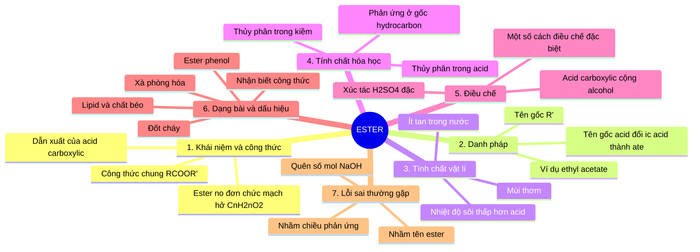

# Lý thuyết Ester - Sơ đồ tư duy Markdown

> Nguồn tham chiếu: `LÝ THUYẾT ESTER-VIẾT TAY.pdf`  
> Mục tiêu: chuyển nội dung Ester thành dạng dễ học, dễ đẩy lên GitHub, có đề mục đánh số và sơ đồ Mermaid.

---

## 0. Sơ đồ tư duy tổng quan



---

## 1. Khái niệm và công thức chung

### 1.1. Ester là gì?

Ester là dẫn xuất của acid carboxylic, trong đó nguyên tử H của nhóm `-COOH` được thay bằng gốc hydrocarbon.

Công thức cấu tạo chung của ester đơn chức:

$$
\mathrm{RCOO}R'
$$

Trong đó:

- `R` là gốc hydrocarbon hoặc H.
- `R'` là gốc hydrocarbon.
- Nhóm chức đặc trưng của ester là `-COO-`.

### 1.2. Công thức phân tử thường gặp

Với ester no, đơn chức, mạch hở:

$$
\mathrm{C_nH_{2n}O_2}\quad (n \ge 2)
$$

Ví dụ:

| Ester | Công thức | Tên thường gặp |
|---|---:|---|
| Methyl formate | $\mathrm{HCOOCH_3}$ | methyl methanoate |
| Methyl acetate | $\mathrm{CH_3COOCH_3}$ | methyl ethanoate |
| Ethyl acetate | $\mathrm{CH_3COOC_2H_5}$ | ethyl ethanoate |

---

## 2. Danh pháp ester

### 2.1. Quy tắc gọi tên

Tên ester thường được gọi theo mẫu:

```text
Tên gốc alcohol R' + tên gốc acid RCOO
```

Trong đó tên acid đổi đuôi:

```text
-ic acid  ->  -ate
```

Ví dụ:

| Công thức ester | Gốc alcohol | Gốc acid | Tên ester |
|---|---|---|---|
| $\mathrm{HCOOCH_3}$ | methyl | formate/methanoate | methyl formate |
| $\mathrm{CH_3COOC_2H_5}$ | ethyl | acetate/ethanoate | ethyl acetate |
| $\mathrm{C_2H_5COOCH_3}$ | methyl | propionate/propanoate | methyl propionate |

### 2.2. Mẹo đọc nhanh tên ester

Khi nhìn công thức:

```text
RCOOR'
```

Ta tách thành:

```text
RCOO- | R'
```

- Phần bên phải `R'` là tên gốc alcohol.
- Phần bên trái `RCOO-` là tên gốc acid.

Ví dụ:

$$
\mathrm{CH_3COOC_2H_5}
$$

Tách:

```text
CH3COO- | C2H5
```

Suy ra:

```text
ethyl acetate / ethyl ethanoate
```

---

## 3. Tính chất vật lí

### 3.1. Mùi và trạng thái

- Nhiều ester có mùi thơm dễ chịu.
- Một số ester có trong tinh dầu, hương hoa, hương quả.
- Ester có phân tử khối nhỏ thường là chất lỏng, dễ bay hơi.

### 3.2. Độ tan và nhiệt độ sôi

Ester thường:

- Ít tan trong nước.
- Nhẹ hơn nước.
- Có nhiệt độ sôi thấp hơn acid carboxylic có phân tử khối tương đương.

Nguyên nhân:

- Ester không có nhóm `-OH` của acid nên không tạo liên kết hydrogen mạnh giữa các phân tử ester với nhau.
- Vì vậy lực hút giữa các phân tử yếu hơn acid carboxylic.

---

## 4. Tính chất hóa học của ester

## 4.1. Phản ứng thủy phân trong môi trường acid

Phản ứng tổng quát:

$$
\mathrm{RCOO}R' + \mathrm{H_2O}
\rightleftharpoons
\mathrm{RCOOH} + R'\mathrm{OH}
$$

Đặc điểm:

- Có xúc tác acid, thường là $\mathrm{H_2SO_4}$ loãng.
- Là phản ứng thuận nghịch.
- Sản phẩm gồm acid carboxylic và alcohol.

Ví dụ:

$$
\mathrm{CH_3COOC_2H_5 + H_2O}
\rightleftharpoons
\mathrm{CH_3COOH + C_2H_5OH}
$$

### 4.2. Phản ứng thủy phân trong môi trường kiềm - xà phòng hóa

Phản ứng tổng quát:

$$
\mathrm{RCOO}R' + \mathrm{NaOH}
\rightarrow
\mathrm{RCOONa} + R'\mathrm{OH}
$$

Đặc điểm:

- Phản ứng một chiều.
- Sản phẩm tạo muối carboxylate và alcohol.
- Đây là phản ứng quan trọng nhất khi giải bài tập ester.

Ví dụ:

$$
\mathrm{CH_3COOC_2H_5 + NaOH}
\rightarrow
\mathrm{CH_3COONa + C_2H_5OH}
$$

### 4.3. Ester của phenol

Với ester có dạng:

$$
\mathrm{RCOOC_6H_5}
$$

Khi phản ứng với NaOH dư, thường cần 2 mol NaOH cho 1 mol ester:

$$
\mathrm{RCOOC_6H_5 + 2NaOH}
\rightarrow
\mathrm{RCOONa + C_6H_5ONa + H_2O}
$$

Dấu hiệu nhận biết:

- Sau thủy phân có muối phenolate $\mathrm{C_6H_5ONa}$.
- Có thể xuất hiện hai muối thay vì một muối và một alcohol thông thường.

### 4.4. Ester có gốc hydrocarbon không no

Nếu ester có liên kết đôi $\mathrm{C=C}$ ở gốc hydrocarbon thì có thể tham gia phản ứng cộng.

Ví dụ phản ứng cộng bromine:

$$
\mathrm{R{-}CH{=}CH_2 + Br_2}
\rightarrow
\mathrm{R{-}CHBr{-}CH_2Br}
$$

Dấu hiệu trong đề:

- Làm mất màu dung dịch bromine.
- Có phản ứng cộng $\mathrm{H_2}$, $\mathrm{Br_2}$, hoặc $\mathrm{KMnO_4}$ tùy cấu trúc.

---

## 5. Điều chế ester

### 5.1. Phản ứng ester hóa

Phản ứng tổng quát:

$$
\mathrm{RCOOH} + R'\mathrm{OH}
\rightleftharpoons
\mathrm{RCOO}R' + \mathrm{H_2O}
$$

Điều kiện thường gặp:

- Xúc tác $\mathrm{H_2SO_4}$ đặc.
- Đun nóng.
- Phản ứng thuận nghịch.

Ví dụ:

$$
\mathrm{CH_3COOH + C_2H_5OH}
\rightleftharpoons
\mathrm{CH_3COOC_2H_5 + H_2O}
$$

### 5.2. Cách tăng hiệu suất ester hóa

Vì phản ứng ester hóa là phản ứng thuận nghịch, muốn tăng hiệu suất tạo ester có thể:

- Dùng dư acid hoặc dư alcohol.
- Tách nước ra khỏi hỗn hợp phản ứng.
- Tách ester ra khỏi hỗn hợp phản ứng nếu phù hợp.

### 5.3. Một số hướng điều chế đặc biệt

Một số ester đặc biệt có thể điều chế từ:

- Acid chloride và alcohol/phenol.
- Anhydride acid và alcohol/phenol.
- Phản ứng cộng giữa acid và alkyne trong một số trường hợp đặc biệt.

---

## 6. Dạng bài tập và dấu hiệu xử lý nhanh

### 6.1. Dạng 1 - Nhận diện ester qua công thức

Dấu hiệu nhận biết ester:

- Có nhóm `-COO-` nằm giữa hai phần carbon.
- Không có H linh động của nhóm `-COOH`.
- Công thức no đơn chức mạch hở thường là $\mathrm{C_nH_{2n}O_2}$.

Câu hỏi thường gặp:

- Chất nào là ester?
- Chất nào không phải ester?
- Chất nào có đồng phân ester?

### 6.2. Dạng 2 - Gọi tên ester

Quy trình:

1. Tách ester theo khung `RCOO | R'`.
2. Đọc tên gốc `R'` trước.
3. Đọc tên gốc acid `RCOO-` sau.

Ví dụ:

$$
\mathrm{CH_3CH_2COOCH_3}
$$

Tách:

```text
CH3CH2COO- | CH3
```

Tên:

```text
methyl propionate / methyl propanoate
```

### 6.3. Dạng 3 - Xà phòng hóa ester đơn chức

Với ester đơn chức thông thường:

$$
1\,\text{mol ester} : 1\,\text{mol NaOH}
$$

Sơ đồ tư duy nhanh:

```text
Ester + NaOH -> muối + alcohol
```

Từ muối tìm phần acid.  
Từ alcohol tìm phần gốc R'.

### 6.4. Dạng 4 - Ester của phenol

Dấu hiệu:

```text
RCOOC6H5 hoặc RCOO-Ar
```

Tư duy nhanh:

```text
Ester phenol + NaOH dư -> muối carboxylate + muối phenolate + H2O
```

Tỉ lệ thường gặp:

$$
1\,\text{mol ester phenol} : 2\,\text{mol NaOH}
$$

### 6.5. Dạng 5 - Đốt cháy ester

Với ester no, đơn chức, mạch hở:

$$
\mathrm{C_nH_{2n}O_2}
$$

Khi đốt cháy:

$$
 n_{\mathrm{CO_2}} = n_{\mathrm{H_2O}}
$$

Dấu hiệu này giúp nhận biết nhanh ester no đơn chức mạch hở hoặc acid carboxylic no đơn chức mạch hở.

### 6.6. Dạng 6 - Bảo toàn khối lượng trong thủy phân

Với phản ứng xà phòng hóa:

$$
\mathrm{Ester + NaOH \rightarrow muối + alcohol}
$$

Có thể dùng bảo toàn khối lượng:

$$
 m_{\text{ester}} + m_{\mathrm{NaOH}} = m_{\text{muối}} + m_{\text{alcohol}}
$$

Dùng khi đề cho khối lượng hỗn hợp, lượng NaOH, khối lượng muối hoặc alcohol.

---

## 7. Liên hệ với lipid và chất béo

### 7.1. Chất béo là gì?

Chất béo là triester của glycerol với acid béo.

Công thức tổng quát:

$$
\mathrm{C_3H_5(OOCR)_3}
$$

### 7.2. Thủy phân chất béo trong môi trường kiềm

Phản ứng tổng quát:

$$
\mathrm{C_3H_5(OOCR)_3 + 3NaOH}
\rightarrow
\mathrm{C_3H_5(OH)_3 + 3RCOONa}
$$

Sản phẩm:

- Glycerol.
- Muối sodium của acid béo, chính là xà phòng.

### 7.3. Dầu mỡ và phản ứng hydrogen hóa

Dầu thực vật thường chứa gốc acid béo không no. Khi hydrogen hóa:

$$
\mathrm{C=C + H_2 \rightarrow C-C}
$$

Kết quả:

- Làm giảm độ không no.
- Có thể chuyển dầu lỏng thành mỡ rắn hơn.

---

## 8. Lỗi sai thường gặp

### 8.1. Nhầm thủy phân acid và thủy phân kiềm

| Môi trường | Chiều phản ứng | Sản phẩm chính |
|---|---|---|
| Acid | Thuận nghịch | Acid + alcohol |
| Kiềm | Một chiều | Muối + alcohol |

### 8.2. Quên ester phenol dùng 2 mol NaOH

Ester thường:

$$
1\,\text{ester} : 1\,\mathrm{NaOH}
$$

Ester của phenol:

$$
1\,\text{ester} : 2\,\mathrm{NaOH}
$$

### 8.3. Nhầm tên gốc alcohol và gốc acid

Cần nhớ:

```text
RCOOR'
```

- Đọc `R'` trước.
- Đọc `RCOO-` sau.

Ví dụ:

$$
\mathrm{CH_3COOC_2H_5}
$$

Không đọc là methyl propionate.  
Đúng là ethyl acetate.

### 8.4. Nhầm ester với acid carboxylic

Acid carboxylic có nhóm:

```text
-COOH
```

Ester có nhóm:

```text
-COO-
```

Ester không làm quỳ tím hóa đỏ như acid carboxylic thông thường.

---

## 9. Checklist ôn tập nhanh

### 9.1. Cần nhớ chắc

- [ ] Công thức chung ester đơn chức: $\mathrm{RCOO}R'$.
- [ ] Ester no đơn chức mạch hở: $\mathrm{C_nH_{2n}O_2}$.
- [ ] Tên ester: gốc alcohol trước, gốc acid sau.
- [ ] Thủy phân acid là thuận nghịch.
- [ ] Xà phòng hóa là một chiều.
- [ ] Ester thường dùng 1 mol NaOH.
- [ ] Ester phenol thường dùng 2 mol NaOH.
- [ ] Chất béo là triester của glycerol và acid béo.

### 9.2. Công thức phản ứng cần thuộc

Ester hóa:

$$
\mathrm{RCOOH} + R'\mathrm{OH}
\rightleftharpoons
\mathrm{RCOO}R' + \mathrm{H_2O}
$$

Thủy phân trong acid:

$$
\mathrm{RCOO}R' + \mathrm{H_2O}
\rightleftharpoons
\mathrm{RCOOH} + R'\mathrm{OH}
$$

Xà phòng hóa:

$$
\mathrm{RCOO}R' + \mathrm{NaOH}
\rightarrow
\mathrm{RCOONa} + R'\mathrm{OH}
$$

Ester phenol:

$$
\mathrm{RCOOC_6H_5 + 2NaOH}
\rightarrow
\mathrm{RCOONa + C_6H_5ONa + H_2O}
$$

Chất béo:

$$
\mathrm{C_3H_5(OOCR)_3 + 3NaOH}
\rightarrow
\mathrm{C_3H_5(OH)_3 + 3RCOONa}
$$

---

## 10. Cách học theo sơ đồ tư duy

### 10.1. Lượt 1 - Nắm khung

Học theo thứ tự:

```text
Khái niệm -> Danh pháp -> Tính chất vật lí -> Tính chất hóa học -> Điều chế -> Dạng bài
```

### 10.2. Lượt 2 - Gắn công thức phản ứng

Với mỗi nhánh, tự viết lại phản ứng đại diện:

- Ester hóa.
- Thủy phân acid.
- Xà phòng hóa.
- Ester phenol.
- Chất béo.

### 10.3. Lượt 3 - Luyện nhận diện đề

Khi gặp bài ester, hỏi nhanh 5 câu:

1. Ester thường hay ester phenol?
2. Đơn chức hay đa chức?
3. No hay không no?
4. Thủy phân tạo alcohol hay phenolate?
5. Dữ kiện đang cần bảo toàn mol, bảo toàn khối lượng hay gọi tên?

