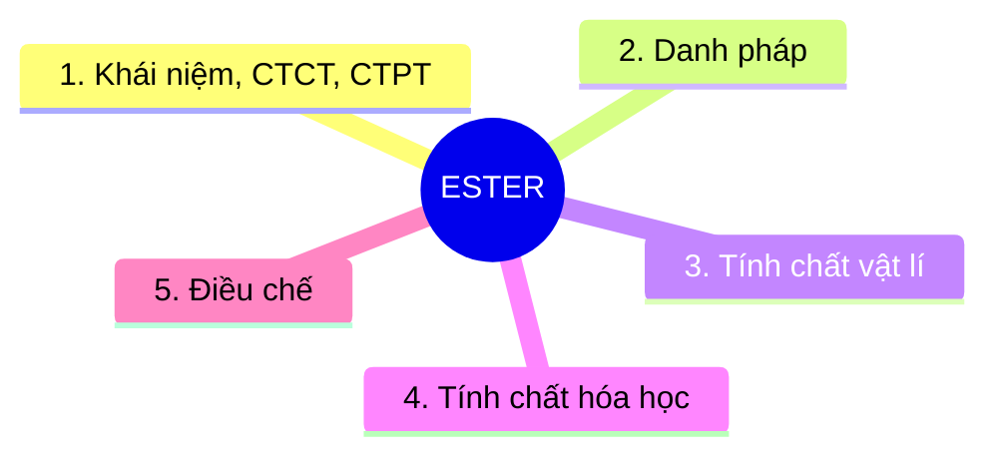

# Lý thuyết Ester - Sơ đồ tư duy Markdown

> Nguồn tham chiếu: `LÝ THUYẾT ESTER-VIẾT TAY.pdf`  
> Mục tiêu: chuyển nội dung Ester thành dạng dễ học, dễ đẩy lên GitHub, có đề mục đánh số và sơ đồ Mermaid.

---

## 0. Sơ đồ tư duy tổng quan



---

## 1. Khái niệm, CTCT, CTPT

### 1.1. Ester là gì?

- Ester = thay -OH của nhóm `-COOH` bằng -OR'.

- Nhóm chức đặc trưng của ester là `-COO-`.

### 1.2. Công thức phân tử 

- HCHC C,H,O bất kỳ: 

$$
\mathrm{C_nH_{2n+2-2k}O_x}
$$

trong đó: k = độ bất bão hòa = pi + vòng = (2C + 2 - H + N)/2
 (Quan trọng cho việc chuyển đổi CTPT và CTCT) 

**Ví dụ**: ester no, đơn chức, mạch hở: no (pi = 0), đơn chức (1 COO), mạch hở (vòng = 0) nên k = 0 + 1 + 0 = 1

$$
\mathrm{C_nH_{2n}O_2}\quad (n \ge 2)
$$ 

**Ví dụ**: ester ko no, hai chức, mạch hở, 1 pi C=C: 1 pi C=C (pi = 1), đơn chức (2 COO), mạch hở (vòng = 0) nên k = 1 + 2 + 0 = 3 

$$
\mathrm{C_nH_{2n-4}O_4}\quad (n \ge 4)
$$ 

### 1.3 Công thức cấu tạo

- Thường từ công thức phân tử suy ra công thức câu tạo (viết đồng phân) theo các bước:

  - B1: Tính k 
  - B2: Dựa theo số O (có thể cả số N) và k ở B1 để suy ra nhóm chức tiềm năng
  - B3: Viết mạch C (thẳng, nhánh) rồi điền nhóm chức vào (Với các nhóm chức chứa C như COO, COOH, CHO thì nên viết nhóm chức trước)

**Ví dụ**: Viết đồng phân $\mathrm{C_4H_6O_2}$
- Bước 1: $k = \frac{2*4+2-6}{2} = 2$ 
- Bước 2: Dựa vào $O_2$ nên có các trường hợp: 1 COO hoặc (1 OH và 1 CHO)
Nếu ta chỉ xét ester thì chắc chắn là 1 COO
- Bước 3: 

Cấu trúc este chung: $\mathrm{...-COO-...}$

Các trường hợp:

$$
\mathrm{H-COO-C_3H_7} \quad (2)
$$

$$
\mathrm{CH_3-COO-C_2H_5} \quad (1)
$$

$$
\mathrm{C_2H_5-COO-CH_3} \quad (1)
$$

Vậy có 4 đồng phân.

- Trường hợp từ công thức cấu tạo tổng quát suy ngược lại công thức phân tử ta đi theo trình tự: Đếm C $\rightarrow$ Đếm O, N(nếu có) $\rightarrow$ Đếm k = pi + vòng $\rightarrow$ Suy ra H cuối cùng với H = (2C + 2 + N - 2k)/2

- Lưu ý: R1COOR2 = R2OOCR1 = R2OCOR1 nhưng khác R2COOR1

---

## 2. Danh pháp ester

- Tên gọi của ester được gọi theo tên gốc chức (Không dùng tên IUPAC vì quá phức tạp, không có tên thông thường) vì vậy phụ thuộc chủ yếu vào các gốc và chức tạo nên ester. 

```text
Tên gốc alcohol R' + tên gốc acid RCOO
```

Trong đó tên acid đổi đuôi:

```text
-ic acid  ->  -ate
```

Do vậy cần phải nhớ tên các gốc và nhớ tên chức (tên chức suy ra từ tên acid)

- Các gốc phải nhớ

| Công thức gốc | Tên gốc |
|---|---|
| `-CH3` | Methyl |
| `-CH2-CH3` | Ethyl |
| `-CH2-CH2-CH3` | Propyl |
| `-CH(CH3)2` | Isopropyl |
| `-CH2-CH2-CH(CH3)-CH3` | Isoamyl |
| `-CH=CH2` | Vinyl |
| `-CH=CH-CH3` | Propenyl |
| `-C(CH3)=CH2` | Isopropenyl |
| `-CH2-CH=CH2` | Allyl |
| `-C6H5` | Phenyl |
| `-CH2-C6H5` | Benzyl |

- Các acid phải nhớ (chủ yếu dùng tên thường)

| Công thức acid | Tên thường | Tên IUPAC |
|---|---|---|
| `HCOOH` | Formic acid | Methanoic acid |
| `CH3COOH` | Acetic acid | Ethanoic acid |
| `C2H5COOH` | Propionic acid | Propanoic acid |
| `n-C3H7COOH` | Butyric acid | Butanoic acid |
| `CH2=CH-COOH` | Acrylic acid | Propenoic acid |
| `CH2=C(CH3)-COOH` | Methacrylic acid | 2-methylpropenoic acid |
| `C6H5-COOH` | Benzoic acid | Benzenecarboxylic acid |
| `HOOC-COOH` | Oxalic acid | Ethanedioic acid |

**Ví dụ**: Gọi tên chất sau: `CH2=C(CH3)-COOCH3`

*Gốc* alcohol là gốc gắn với O trong COO $\rightarrow$ `-CH3`: methyl

*Chức* ester được suy ra từ acid tương ứng:
`CH2=C(CH3)-COOH`: methacrylic acid $\rightarrow$ `CH2=C(CH3)-COO`: methacrylate

Vậy tên gọi là gốc + chức: methyl methacrylate

---

## 3. Tính chất vật lí

- Mùi thơm hoa quả đặc trưng, an toàn (hương liệu). 
VD: `CH3COOCH2-CH2-CH(CH3)-CH3`  
  → Isoamyl acetate: mùi chuối chín. `CH3COOCH2C6H5`  
  → Benzyl acetate: mùi hoa nhài.
  → Ethyl butyrate, ethyl propionate: mùi thơm của dứa
- Lỏng or rắn
- Ít tan or ko tan trong nước, nhẹ hơn nước
- Thứ tự nhiệt độ sôi:
Muối > Acid > Alcohol > Amine > Ester, Aldehyde, Ketone > ... > Hydrocarbon.

---

## 4. Tính chất hóa học

Khi xét tính chất hóa học của một chất ta đi từ cấu tạo đầu tiên. Cấu tạo ester tạo bởi sự ghép nối giữa 2 thành phần là acid và alcohol.

## 4.1. Phản ứng thủy phân cơ bản

- Môi trường acid ($H^+$)

```math
\mathrm{RCO|OR' + H_2O \xrightleftharpoons[\,t^\circ\,]{\,H^+\,} RCOOH + R'OH}
```

   Có xúc tác acid, thường là $\mathrm{H_2SO_4}$ loãng.
   Là phản ứng thuận nghịch.
   Sản phẩm gồm acid carboxylic và alcohol.

Ví dụ:

$$
\mathrm{CH_3COOC_2H_5 + H_2O}
\rightleftharpoons
\mathrm{CH_3COOH + C_2H_5OH}
$$

- Môi trường kiềm (Phản ứng xà phòng hóa)

$$
\mathrm{RCO|O}R' + \mathrm{NaOH}
\rightarrow
\mathrm{RCOONa} + R'\mathrm{OH}
$$

1 COO thường cần 1 NaOH
Phản ứng một chiều.
Sản phẩm tạo muối carboxylate và alcohol.

Ví dụ:

$$
\mathrm{CH_3COOC_2H_5 + NaOH}
\rightarrow
\mathrm{CH_3COONa + C_2H_5OH}
$$

Bên cạnh phản ứng đến từ cấu tạo ta cũng xét các ngoại lệ nhưng rất quan trọng

### 4.2. Ester của phenol

- Ester phenol = nhóm -COO- với O gắn với vòng benzen

- Thủy phân trong môi trường acid:

```math
\mathrm{RCO|OC_6H_5 + HOH \xrightarrow{t^\circ} RCOOH + C_6H_5OH}
```

```math
\mathrm{RCO|OC_6H_4R' + HOH \xrightarrow{t^\circ} RCOOH + R'C_6H_4OH}
```

Phản ứng một chiều vì sản phẩm không phản ứng ngược lại vì phenol có tính acid không phản ứng với acid.

- Thủy phân trong môi trường kiềm:
```math
\mathrm{RCOOC_6H_5 + 2NaOH \xrightarrow{t^\circ} RCOONa + C_6H_5ONa + H_2O}
```

```math
\mathrm{RCOOC_6H_4R' + 2NaOH \xrightarrow{t^\circ} RCOONa + R'C_6H_4ONa + H_2O}
```

1 COO phenol cần 2 NaOH
Sau thủy phân có muối phenolate $\mathrm{C_6H_5ONa}$.
Xuất hiện 2 muối và H2O.

### 4.4. Ester tạo sản phẩm không bền

- Tạo aldehyde

```math
\mathrm{RCOO{-}C{=}C{-}R' + H_2O}
\mathrm{\rightarrow RCOOH + HO{-}C{=}C{-}R'}
```

Không tồn tại C không no đính với -OH nên chuyển nối đôi sang chỗ C-O

```math
\mathrm{HO{-}C{=}C{-}R' \rightarrow O{=}CH{-}C{-}R'}
```

Hay viết tương đương:

```math
\mathrm{O{=}CH{-}C{-}R' \Leftrightarrow R'{-}C{-}CHO}
```
Tổng kết: 

```math
\mathrm{RCOO{-}C{=}C{-}R' + H_2O}
\mathrm{\rightarrow RCOOH + R'{-}C{-}CHO}
```
- Tạo ketone:

```math
\mathrm{RCOO{-}C(R_1){=}C{-}R_2 + H_2O}
```

```math
\mathrm{\rightarrow RCOOH + HO{-}C(R_1){=}C{-}R_2}
```

Không tồn tại C không no đính với -OH nên chuyển nối đôi sang chỗ C-O

```math
\mathrm{HO{-}C(R_1){=}C{-}R_2 \rightarrow O{=}C(R_1){-}C{-}R_2}
```

### 4.5. Tính chất của chức:

- HCOOR' vẫn màn tính chất của aldehyde vì có -CHO
- Phản ứng trùng hợp tạo thủy tinh hữu cơ:

```math
\mathrm{nCH_2{=}C(CH_3){-}COOCH_3 \xrightarrow{t^\circ}
\left[-CH_2{-}C(CH_3)(COOCH_3)-\right]_n}
```
 `CH2=C(CH3)-COOCH3`: **Methyl methacrylate**
 Sản phẩm: **Polymethyl methacrylate**, còn gọi là **thủy tinh hữu cơ**

---

## 5. Điều chế ester

- Ester tạo bởi acid và alcohol tương ứng: (phản ứng ester hóa)

```math
\mathrm{RCO|OH + R'O|H \xrightleftharpoons[\,t^\circ\,]{\,H^+\,} RCOOR' + H_2O}
```

Lưu ý:
- Dùng acid, alcohol nồng độ cao
- Hiệu suất cao tương ứng cân bằng dịch chuyển theo chiều thuận nên có thể
  - Dùng dư acid hoặc alcohol
  - Dùng H2SO4 đặc để xúc tác và hút nước 
- Tách ester bằng pp chiết. Để phân lớp rõ ràng cho thêm vài ml NaCl bão hoàn (vài ml nước lạnh) (Tăng D H2O)

- Phản ứng tạo vinyl ester từ acid carboxylic và acetylene

```math
\mathrm{RCOOH + CH{\equiv}CH \xrightarrow[(t^\circ)]{(CH_3COO)_2Zn} RCOO{-}CH{=}CH_2}
```

---

