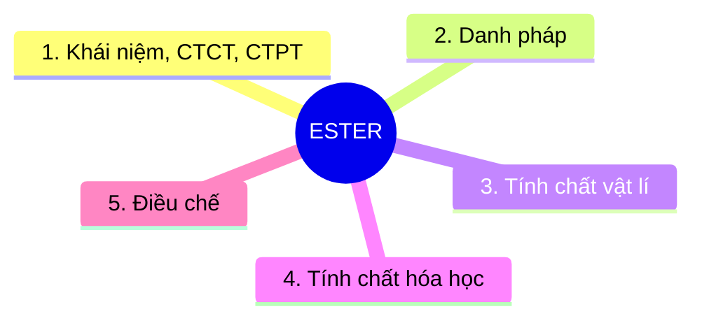

# Lý thuyết Ester - Sơ đồ tư duy Markdown

> Nguồn tham chiếu: `LÝ THUYẾT ESTER-VIẾT TAY.pdf`  
> Mục tiêu: chuyển nội dung Ester thành dạng dễ học, dễ đẩy lên GitHub, có đề mục đánh số và sơ đồ Mermaid.

---

## 0. Sơ đồ tư duy tổng quan



---

## 1. Khái niệm, CTCT, CTPT

### 1.1. Ester là gì?

- Ester = thay -OH của nhóm `-COOH` bằng -OR'.

- Nhóm chức đặc trưng của ester là `-COO-`.

### 1.2. Công thức phân tử 

- HCHC C,H,O bất kỳ: 

$$
\mathrm{C_nH_{2n+2-2k}O_x}
$$

trong đó: k = độ bất bão hòa = pi + vòng = (2C + 2 - H + N)/2
 (Quan trọng cho việc chuyển đổi CTPT và CTCT) 

**Ví dụ**: ester no, đơn chức, mạch hở: no (pi = 0), đơn chức (1 COO), mạch hở (vòng = 0) nên k = 0 + 1 + 0 = 1

$$
\mathrm{C_nH_{2n}O_2}\quad (n \ge 2)
$$ 

**Ví dụ**: ester ko no, hai chức, mạch hở, 1 pi C=C: 1 pi C=C (pi = 1), đơn chức (2 COO), mạch hở (vòng = 0) nên k = 1 + 2 + 0 = 3 

$$
\mathrm{C_nH_{2n-4}O_4}\quad (n \ge 4)
$$ 

### 1.3 Công thức cấu tạo

- Thường từ công thức phân tử suy ra công thức câu tạo (viết đồng phân) theo các bước:

  - B1: Tính k 
  - B2: Dựa theo số O (có thể cả số N) và k ở B1 để suy ra nhóm chức tiềm năng
  - B3: Viết mạch C (thẳng, nhánh) rồi điền nhóm chức vào (Với các nhóm chức chứa C như COO, COOH, CHO thì nên viết nhóm chức trước)

**Ví dụ**: Viết đồng phân $\mathrm{C_4H_6O_2}$
- Bước 1: $k = \frac{2*4+2-6}{2} = 2$ 
- Bước 2: Dựa vào $O_2$ nên có các trường hợp: 1 COO hoặc (1 OH và 1 CHO)
Nếu ta chỉ xét ester thì chắc chắn là 1 COO
- Bước 3: 

Cấu trúc este chung: $\mathrm{...-COO-...}$

Các trường hợp:

$$
\mathrm{H-COO-C_3H_7} \quad (2)
$$

$$
\mathrm{CH_3-COO-C_2H_5} \quad (1)
$$

$$
\mathrm{C_2H_5-COO-CH_3} \quad (1)
$$

Vậy có 4 đồng phân.

- Trường hợp từ công thức cấu tạo tổng quát suy ngược lại công thức phân tử ta đi theo trình tự: Đếm C $\rightarrow$ Đếm O, N(nếu có) --> Đếm k = pi + vòng --> Suy ra H cuối cùng với H = (2C + 2 + N - 2k)/2

## 2. Danh pháp ester

### 2.1. Quy tắc gọi tên

Tên ester thường được gọi theo mẫu:

```text
Tên gốc alcohol R' + tên gốc acid RCOO
```

Trong đó tên acid đổi đuôi:

```text
-ic acid  ->  -ate
```

Ví dụ:

| Công thức ester | Gốc alcohol | Gốc acid | Tên ester |
|---|---|---|---|
| $\mathrm{HCOOCH_3}$ | methyl | formate/methanoate | methyl formate |
| $\mathrm{CH_3COOC_2H_5}$ | ethyl | acetate/ethanoate | ethyl acetate |
| $\mathrm{C_2H_5COOCH_3}$ | methyl | propionate/propanoate | methyl propionate |

### 2.2. Mẹo đọc nhanh tên ester

Khi nhìn công thức:

```text
RCOOR'
```

Ta tách thành:

```text
RCOO- | R'
```

- Phần bên phải `R'` là tên gốc alcohol.
- Phần bên trái `RCOO-` là tên gốc acid.

Ví dụ:

$$
\mathrm{CH_3COOC_2H_5}
$$

Tách:

```text
CH3COO- | C2H5
```

Suy ra:

```text
ethyl acetate / ethyl ethanoate
```

---

## 3. Tính chất vật lí

### 3.1. Mùi và trạng thái

- Nhiều ester có mùi thơm dễ chịu.
- Một số ester có trong tinh dầu, hương hoa, hương quả.
- Ester có phân tử khối nhỏ thường là chất lỏng, dễ bay hơi.

### 3.2. Độ tan và nhiệt độ sôi

Ester thường:

- Ít tan trong nước.
- Nhẹ hơn nước.
- Có nhiệt độ sôi thấp hơn acid carboxylic có phân tử khối tương đương.

Nguyên nhân:

- Ester không có nhóm `-OH` của acid nên không tạo liên kết hydrogen mạnh giữa các phân tử ester với nhau.
- Vì vậy lực hút giữa các phân tử yếu hơn acid carboxylic.

---

## 4. Tính chất hóa học của ester

## 4.1. Phản ứng thủy phân trong môi trường acid

Phản ứng tổng quát:

$$
\mathrm{RCOO}R' + \mathrm{H_2O}
\rightleftharpoons
\mathrm{RCOOH} + R'\mathrm{OH}
$$

Đặc điểm:

- Có xúc tác acid, thường là $\mathrm{H_2SO_4}$ loãng.
- Là phản ứng thuận nghịch.
- Sản phẩm gồm acid carboxylic và alcohol.

Ví dụ:

$$
\mathrm{CH_3COOC_2H_5 + H_2O}
\rightleftharpoons
\mathrm{CH_3COOH + C_2H_5OH}
$$

### 4.2. Phản ứng thủy phân trong môi trường kiềm - xà phòng hóa

Phản ứng tổng quát:

$$
\mathrm{RCOO}R' + \mathrm{NaOH}
\rightarrow
\mathrm{RCOONa} + R'\mathrm{OH}
$$

Đặc điểm:

- Phản ứng một chiều.
- Sản phẩm tạo muối carboxylate và alcohol.
- Đây là phản ứng quan trọng nhất khi giải bài tập ester.

Ví dụ:

$$
\mathrm{CH_3COOC_2H_5 + NaOH}
\rightarrow
\mathrm{CH_3COONa + C_2H_5OH}
$$

### 4.3. Ester của phenol

Với ester có dạng:

$$
\mathrm{RCOOC_6H_5}
$$

Khi phản ứng với NaOH dư, thường cần 2 mol NaOH cho 1 mol ester:

$$
\mathrm{RCOOC_6H_5 + 2NaOH}
\rightarrow
\mathrm{RCOONa + C_6H_5ONa + H_2O}
$$

Dấu hiệu nhận biết:

- Sau thủy phân có muối phenolate $\mathrm{C_6H_5ONa}$.
- Có thể xuất hiện hai muối thay vì một muối và một alcohol thông thường.

### 4.4. Ester có gốc hydrocarbon không no

Nếu ester có liên kết đôi $\mathrm{C=C}$ ở gốc hydrocarbon thì có thể tham gia phản ứng cộng.

Ví dụ phản ứng cộng bromine:

$$
\mathrm{R{-}CH{=}CH_2 + Br_2}
\rightarrow
\mathrm{R{-}CHBr{-}CH_2Br}
$$

Dấu hiệu trong đề:

- Làm mất màu dung dịch bromine.
- Có phản ứng cộng $\mathrm{H_2}$, $\mathrm{Br_2}$, hoặc $\mathrm{KMnO_4}$ tùy cấu trúc.

---

## 5. Điều chế ester

### 5.1. Phản ứng ester hóa

Phản ứng tổng quát:

$$
\mathrm{RCOOH} + R'\mathrm{OH}
\rightleftharpoons
\mathrm{RCOO}R' + \mathrm{H_2O}
$$

Điều kiện thường gặp:

- Xúc tác $\mathrm{H_2SO_4}$ đặc.
- Đun nóng.
- Phản ứng thuận nghịch.

Ví dụ:

$$
\mathrm{CH_3COOH + C_2H_5OH}
\rightleftharpoons
\mathrm{CH_3COOC_2H_5 + H_2O}
$$

### 5.2. Cách tăng hiệu suất ester hóa

Vì phản ứng ester hóa là phản ứng thuận nghịch, muốn tăng hiệu suất tạo ester có thể:

- Dùng dư acid hoặc dư alcohol.
- Tách nước ra khỏi hỗn hợp phản ứng.
- Tách ester ra khỏi hỗn hợp phản ứng nếu phù hợp.

### 5.3. Một số hướng điều chế đặc biệt

Một số ester đặc biệt có thể điều chế từ:

- Acid chloride và alcohol/phenol.
- Anhydride acid và alcohol/phenol.
- Phản ứng cộng giữa acid và alkyne trong một số trường hợp đặc biệt.

---


-


